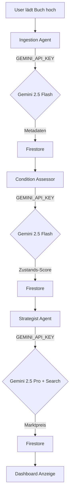

# Refactoring-Plan: Entfernung UserLLMManager & Umstellung auf System-Gemini-Key

Dieses Dokument beschreibt den detaillierten Plan zur Entfernung der `user_llm_manager` Komponente und der Umstellung aller Agenten auf eine konsistente, systemweite Nutzung von Google Gemini über den `GEMINI_API_KEY` (bzw. Vertex AI im produktiven Umfeld).

## 1. Zielsetzung
- Komplexitätsreduktion durch Entfernung der benutzerbezogenen LLM-Key-Verwaltung.
- Vereinheitlichung der LLM-Integration in allen Agenten auf Basis des neuen `google-genai` SDKs.
- Sicherstellung der Funktionalität (insb. Google Search Retrieval im Strategist).
- Bereinigung von UI und Backend-Endpunkten.

## 2. Betroffene Komponenten & Änderungen

### 2.1 Agenten (Refactoring auf `google-genai` SDK)

Jeder Agent wird so umgestellt, dass er denselben Initialisierungs-Standard wie der `condition-assessor` nutzt.

#### Standard-Initialisierung (Vorlage)
```python
from google import genai
from google.genai import types

# Initialisierung
project_id = os.environ.get("GCP_PROJECT") or os.environ.get("GOOGLE_CLOUD_PROJECT")
location = os.environ.get("GCP_REGION", "us-central1")

if project_id:
    # Produktion / Vertex AI
    genai_client = genai.Client(vertexai=True, project=project_id, location=location)
else:
    # Lokal / API Key
    api_key = os.getenv("GEMINI_API_KEY")
    genai_client = genai.Client(api_key=api_key)
```

#### Spezifische Agenten-Änderungen

| Agent | Status Quo | Ziel-Zustand | Besonderheiten |
| :--- | :--- | :--- | :--- |
| **Strategist** | Nutzt `UserLLMManager` | Nutzt `google-genai` direkt | Muss `tools=[types.Tool(google_search=types.GoogleSearch())]` für Pricing-Recherche nutzen. |
| **Ambassador** | Nutzt `UserLLMManager` | Nutzt `google-genai` direkt | Umstellung von OpenAI (GPT-4) auf Gemini (2.5 Flash/Pro) für Beschreibungs-Optimierung. |
| **Ingestion** | Nutzt `google-genai` (teilweise inlined) | Nutzt standardisierte Initialisierung | Umstellung von `GOOGLE_API_KEY` auf `GEMINI_API_KEY` für Konsistenz. |
| **Condition Assessor** | Bereits umgestellt | Keine Änderung nötig | Dient als Referenz-Implementierung. |

---

### 2.2 Backend (`dashboard/backend/main.py`)

Die Verwaltung von Benutzer-Credentials wird vollständig entfernt.

**Zu entfernende Teile:**
- **Imports:** `UserLLMManager`, `CredentialManager`, `UsageTracker` aus `shared.user_llm_manager`.
- **Initialisierung:** Globales Setup dieser Manager in `dashboard/backend/main.py`.
- **API Endpunkte:**
    - `GET /api/llm/credentials`
    - `POST /api/llm/credentials`
    - `DELETE /api/llm/credentials/<id>`
    - `GET /api/llm/settings`
    - `PUT /api/llm/settings`
    - `GET /api/llm/usage`
    - `GET /api/llm/provider-status`
    - `POST /api/llm/test-credential`

---

### 2.3 Frontend (`dashboard/frontend/`)

Die UI zur Verwaltung von LLM-Keys wird deaktiviert.

**Änderungen:**
- **`src/App.jsx`**: Entfernung der Route `/llm-settings` und des entsprechenden Navigations-Links.
- **`src/components/LLMSettings.jsx`**: Löschen der Komponente (oder Deaktivierung).
- **Bereinigung**: Entfernung aller Aufrufe der oben genannten Backend-Endpunkte.

---

### 2.4 Shared Library (`shared/user_llm_manager`)

Das Verzeichnis `shared/user_llm_manager` bleibt vorerst als Archiv bestehen, wird aber nicht mehr aktiv eingebunden. Ein späteres Löschen ist nach erfolgreicher Umstellung aller Komponenten geplant.

---

## 3. Implementierungsschritte (Todo-Liste)

### Phase 1: Vorbereitung
- [ ] Backup/Archivierung der `shared/user_llm_manager` (falls nötig).
- [ ] Sicherstellen, dass `GEMINI_API_KEY` in der `.env` aller Agenten und im Backend gesetzt ist.

### Phase 2: Agenten-Refactoring
- [ ] **Strategist Agent**:
    - [ ] Import `UserLLMManager` entfernen.
    - [ ] `google-genai` SDK integrieren.
    - [ ] Pricing-Logik auf Gemini 2.5 Pro umstellen.
    - [ ] Google Search Tool in den Request einbauen.
- [ ] **Ambassador Agent**:
    - [ ] Import `UserLLMManager` entfernen.
    - [ ] Umstellung der Beschreibungs-Generierung auf Gemini.
- [ ] **Ingestion Agent**:
    - [ ] Vereinheitlichung der API-Key Variable auf `GEMINI_API_KEY`.
    - [ ] Bereinigung inlined Code-Fragmente.

### Phase 3: Backend & Frontend Bereinigung
- [ ] **Backend**:
    - [ ] Entfernung der LLM-Endpunkte in `main.py`.
    - [ ] Entfernung der Manager-Initialisierung.
- [ ] **Frontend**:
    - [ ] Entfernung der "LLM Settings" Navigation in `App.jsx`.
    - [ ] Löschen der Datei `LLMSettings.jsx`.

### Phase 4: Validierung
- [ ] End-to-End Test: Bilder hochladen -> Ingestion -> Condition Assessment -> Pricing.
- [ ] Verifikation, dass im Pricing-Bericht des Strategist weiterhin externe Quellen (Google Search) auftauchen.

---

## 4. Mermaid Diagramm: Neuer LLM-Fluss (System-Level)



## 5. Risiken & Fallback
- **Quota Limits**: Durch die Nutzung eines einzelnen System-Keys teilen sich alle Nutzer die Quota.
    - *Mitigation*: Überwachung der Vertex AI Quotas und ggf. Erhöhung beantragen.
- **Search Retrieval**: Änderungen in der Syntax des `google-genai` SDKs könnten das Search-Tool betreffen.
    - *Mitigation*: Test-Skript `tests/verification/verify_search_tool.py` vorab ausführen.
