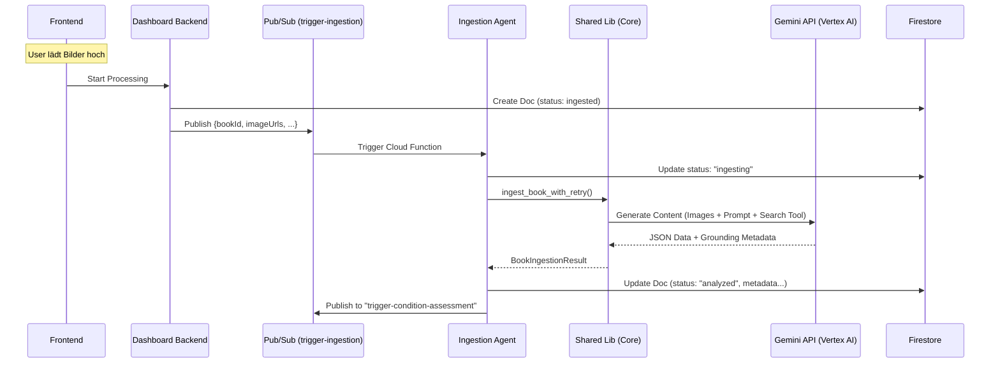

# Ingestion Agent - Technische Dokumentation

**Version:** 3.0.0 (Shared Library Migration)
**Status:** ✅ DEPLOYED
**Letztes Update:** 05. Februar 2026
**Agent-Datei:** [`agents/ingestion-agent/main.py`](../../agents/ingestion-agent/main.py)
**Shared Library:** [`shared/simplified_ingestion/`](../../shared/simplified_ingestion/)

---

## 📋 Übersicht & Zweck

Der **Ingestion Agent** ist der Einstiegspunkt für die Buch-Verarbeitungspipeline. Er identifiziert Bücher anhand von Nutzer-hochgeladenen Fotos, reichert Metadaten an und bereitet die Daten für die nachfolgenden Prozesse (Zustandsbewertung, Pricing) vor.

Das System basiert auf einer vereinfachten "AI-First" Architektur, bei der **Gemini 2.5 Pro** (oder neuer) sowohl die visuelle Analyse als auch die Fakten-Recherche (via Search Grounding) in einem einzigen Schritt übernimmt. Komplexe manuelle "Data Fusion" Logik und Legacy OCR-Komponenten wurden zugunsten dieses robusten Ansatzes entfernt.

### Hauptfunktionen

- ✅ **Visuelle Identifikation:** Erkennt Buchtitel, Autor, Verlag und Edition direkt aus Fotos (Cover, Spine, Seite).
- ✅ **AI-Powered Research:** Nutzt Gemini mit **Google Search Grounding**, um ISBNs zu verifizieren und fehlende Metadaten live im Web zu recherchieren.
- ✅ **Simplified Pipeline:** Ersetzt mehrere Legacy-Agenten (Scribe, OCR-Pipeline) durch einen zentralen Prozess.
- ✅ **Automatische Retry-Logik:** Robustes Handling von transienten Fehlern (Rate Limits, Timeouts) via Shared Library.
- ✅ **Idempotenz:** Verhindert doppelte Verarbeitung bereits analysierter Bücher.

---

## 🏗️ Technische Architektur

### Deployment-Konfiguration

Der Agent ist als Google Cloud Function (oder Cloud Run Service) deployt und reagiert auf Pub/Sub Events.

```yaml
Service Type: Cloud Function (2nd Gen)
Runtime: Python 3.11
Region: europe-west1
Memory: 2GB (für In-Memory Image Processing)
Timeout: 540s
Trigger: Pub/Sub Topic "trigger-ingestion"
```

### Shared Library Integration

Der Agent ist ein schlanker Wrapper ("Infrastructure Layer") um die Shared Library `shared.simplified_ingestion`.

- **Wrapper (`agents/ingestion-agent/main.py`):** Kümmert sich um Pub/Sub Event Parsing, Firestore Status-Management und Weiterleitung an den Condition Assessor.
- **Core Logic (`shared/simplified_ingestion/core.py`):** Beinhaltet die eigentliche Business-Logik, Gemini-Interaktion, Retry-Schleifen und Image-Handling.

### AI Model & Grounding

- **Model:** Gemini 2.5 Pro (konfigurierbar via Env Var `GEMINI_MODEL`, Default in `config.py`).
- **Tools:** `GoogleSearchRetrieval` ist standardmäßig aktiviert.
- **Vorteil:** Das Model entscheidet selbstständig, wann es externe Informationen (z.B. Erscheinungsjahr, genaue ISBN) suchen muss, um die visuellen Informationen zu ergänzen.

---

## 🔄 Workflow & Datenfluss



### Detaillierter Ablauf

1.  **Trigger:** Backend sendet Nachricht an Topic `trigger-ingestion` mit `bookId`, `uid` und `imageUrls` (GCS Pfade).
2.  **Validierung:** Agent prüft, ob Buch bereits final verarbeitet ist. Setzt Status auf `ingesting`.
3.  **Image Loading:** Bilder werden direkt aus GCS in den Speicher geladen (via `prepare_images` in Shared Lib).
4.  **AI Analyse:**
    *   Bilder + System Prompt werden an Gemini gesendet.
    *   Google Search Tool ist aktiv für Fakten-Validierung.
    *   Output ist striktes JSON.
5.  **Persistenz:** Ergebnis wird in Firestore unter `users/{uid}/books/{bookId}` gespeichert.
6.  **Next Step:** Bei Erfolg wird der Condition Assessor via Pub/Sub getriggert.

---

## 🗄️ Datenmodelle (Firestore)

Das Ergebnis der Ingestion wird im Buch-Dokument gespeichert.

**Collection:** `users/{uid}/books/{bookId}`

```json
{
  "status": "analyzed", // oder "analysis_failed"
  "title": "Der Name der Rose",
  "authors": ["Umberto Eco"],
  "isbn": "9783446201345",
  "publisher": "Hanser",
  "publication_year": 1982,
  "language": "de",
  "description": "Ein historischer Kriminalroman...",
  "cover_url": "https://...", // Generiert oder ausgewähltes Bild
  "confidence_score": 0.95,
  "sources_used": ["Google Books", "Wikipedia"],
  "_metadata": {
    "processing_time_ms": 4500,
    "simplified_ingestion": true,
    "library_version": "v3.0.0",
    "grounding_metadata": {
      "search_active": true,
      "source_urls": ["https://google.com/search?q=..."]
    }
  }
}
```

---

## ⚙️ Konfiguration

### Environment Variables

| Variable | Beschreibung | Erforderlich |
| :--- | :--- | :--- |
| `GCP_PROJECT` | Google Cloud Projekt ID | Ja |
| `GEMINI_MODEL` | Spezifisches Gemini Model (z.B. `gemini-2.5-pro`) | Optional (Default in Config) |
| `GEMINI_API_KEY` | API Key (falls nicht Vertex AI Auth genutzt wird) | Optional |

### Shared Library Config (`shared/simplified_ingestion/config.py`)

Zentrale Konfiguration für Retries und Prompts:
- `retry_attempts`: Standardmäßig 3.
- `retry_delay_seconds`: Initiale Wartezeit für Exponential Backoff.
- `enable_grounding`: `True` (hardcoded im Agent).

---

## 🔍 Troubleshooting & Logs

### Logging
Der Agent nutzt strukturiertes JSON-Logging. Wichtige Log-Einträge:

- **Start:** `📨 Received Pub/Sub message - bookId: ...`
- **Status:** `✅ Updated status to 'ingesting' for ...`
- **AI Call:** `Making Google GenAI API call with X images`
- **Success:** `Simplified ingestion processed for book ... status analyzed`
- **Next Step:** `✅ Successfully published condition assessment job`

### Häufige Fehler

1.  **`INGESTION_NO_DATA` / "Gemini returned no book data"**
    *   **Ursache:** Das Modell konnte auf den Bildern kein Buch erkennen oder die JSON-Antwort war leer.
    *   **Lösung:** Bildqualität prüfen.

2.  **Rate Limits (429)**
    *   **Verhalten:** Die Shared Library fängt dies ab und führt automatische Retries durch.
    *   **Lösung:** Quota im Google Cloud Console prüfen, falls Fehler persistiert.

3.  **"Document does NOT exist"**
    *   **Ursache:** Race Condition zwischen Backend-Erstellung und Agent-Start (selten), oder falsche IDs.
    *   **Lösung:** Prüfen, ob `bookId` und `uid` in der Pub/Sub Nachricht korrekt sind.

---

## 🔗 Integration

- **Upstream:** Wird getriggert vom **Dashboard Backend** via Pub/Sub `trigger-ingestion`.
- **Downstream:** Triggert den **Condition Assessor** via Pub/Sub `trigger-condition-assessment` nach erfolgreicher Analyse.
- **Storage:** Liest Bilder aus **Cloud Storage**.
- **Database:** Schreibt Ergebnisse in **Firestore**.
