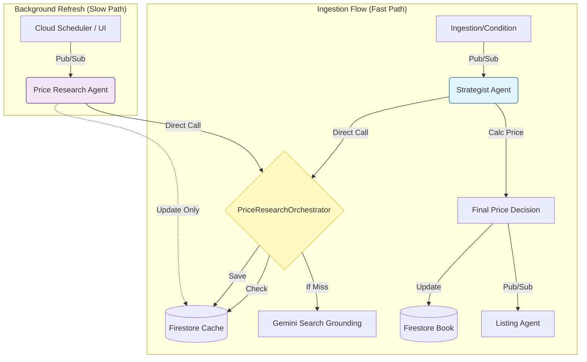

# Optimierungsvorschlag: Price Team Architecture (V2)

## 1. Analyse des Status Quo & Schwachstellen

Basierend auf der Analyse von `docs/agents/PRICE_TEAM_INTERACTION.md` und `plans/SCOUT_AGENT_ARCHITECTURE_REDESIGN.md` wurden folgende Schwachstellen identifiziert:

1.  **Unnötige Komplexität durch "Polling":** Der Entwurf im Redesign-Plan sieht vor, dass der Strategist Agent eine Anfrage in Pub/Sub stellt und dann aktiv *wartet* (Polling), bis der Price Research Agent fertig ist. Da der Strategist selbst bereits asynchron (via Pub/Sub vom Condition Assessor) getriggert wird und Google Cloud Functions (Gen 2) Laufzeiten von bis zu 60 Minuten unterstützen, ist dieser asynchrone "Detour" über Pub/Sub für den Hauptprozess (Ingestion) ineffizient und fehleranfällig.
2.  **Veralteter "Scout Agent":** Der Scout Agent wird zwar als "Legacy" bezeichnet, ist aber in der Dokumentation noch als aktive Komponente geführt. Die Architektur sollte diesen Ballast nun offiziell abwerfen.
3.  **Fragmentierung der Logik:** Die Trennung zwischen Strategist (Entscheider) und Research (Datenbeschaffer) über eine harte Pub/Sub-Grenze für den *Standard-Flow* (neues Buch) erschwert das Error Handling (was passiert, wenn die Pub/Sub Message verloren geht?).

## 2. Proposed Architecture (Die Lösung)

Wir wechseln zu einer **Bibliotheks-basierten Orchestrierung** für den Hauptprozess ("Direct Library Call"), behalten aber den eigenständigen Agenten für Hintergrundaufgaben ("Background Worker").

### Kernänderungen:
*   **Direct Invocation:** Der **Strategist Agent** integriert den `PriceResearchOrchestrator` direkt als Library. Er ruft `await orchestrator.research_price()` auf. Dies nutzt die asynchrone Natur von Python (`asyncio`) effizient, ohne Infrastruktur-Overhead.
*   **Scout Agent:** Wird **gelöscht**. Alle Scraping-Aufgaben werden durch Gemini Grounding (im Orchestrator) ersetzt.
*   **Price Research Agent:** Bleibt als eigenständige Cloud Function bestehen, dient aber **ausschließlich** für asynchrone Hintergrund-Updates (z.B. "Refresh Price"-Button im Dashboard oder Cron-Jobs), die *nicht* Teil des kritischen Ingestion-Pfads sind.

### Vorteile:
*   **Schneller:** Wegfall von Pub/Sub-Latenz und Polling für neue Bücher.
*   **Robuster:** Atomic Operation im Strategist (Input -> Research -> Pricing -> Output).
*   **Einfacher:** Weniger bewegliche Teile im Standard-Flow.

---

## 3. Neuer Dokumentations-Inhalt

Nachfolgend der vollständige Text, der `docs/agents/PRICE_TEAM_INTERACTION.md` ersetzen sollte.

```markdown
# Preisagententeam: Interaktion & Architektur V2

Dieses Dokument beschreibt die optimierte Architektur (Stand: Januar 2026) für das Zusammenspiel zwischen dem **Strategist Agent** und den Research-Komponenten.

## 1. Übersicht & Rollen

Das System verzichtet auf den veralteten "Scout Agent" und setzt auf eine direkte Integration der Recherche-Logik in den Strategisten für maximale Effizienz, während ein separater Worker für Hintergrund-Aktualisierungen bereitsteht.

| Komponente | Typ | Verantwortung | Trigger |
| :--- | :--- | :--- | :--- |
| **Price Research Orchestrator** | `Shared Library` | Enthält die Kernlogik: Cache-Check, Gemini Search Grounding, Daten-Fusion und Speichern in Firestore. Wird von beiden Agenten genutzt. | *Code Call* |
| **Strategist Agent** | `Cloud Function` | **Der Entscheider.** Koordiniert den Ingestion-Prozess für ein neues Buch. Ruft den Orchestrator *direkt* auf, um Live-Preise zu erhalten. | Pub/Sub: `condition-assessment-completed` |
| **Price Research Agent** | `Cloud Function` | **Der Hintergrund-Arbeiter.** Führt regelmäßige Updates oder manuelle Re-Scans durch, ohne den Listing-Prozess direkt zu triggern. | Pub/Sub: `price-research-requests` |

## 2. Architektur-Diagramm



## 3. Detaillierter Datenfluss

### A. Der Standard-Prozess (Neues Buch)
Wenn ein Buch neu ins System kommt, muss der Preis **sofort** verfügbar sein, um den Listing-Prozess nicht zu blockieren.

1.  **Trigger:** Der `Strategist Agent` erhält die Nachricht, dass der Zustand bewertet wurde.
2.  **Orchestration:** Der Strategist instanziiert den `PriceResearchOrchestrator`.
3.  **Research (async):** Der Strategist ruft `await orchestrator.research_price(...)` auf.
    *   Der Orchestrator prüft `market_data` (Cache < 7 Tage).
    *   Bei Cache-Miss: Parallele Abfrage via Gemini Grounding (Dauer: ~5-10s).
    *   Ergebnisse werden in Firestore gespeichert.
4.  **Pricing:** Der Strategist lädt die **detaillierten Zustandsdaten** (AI Grade, Defect List) aus dem `condition_assessments`-Dokument. Diese werden zusammen mit den Marktdaten in den Prompt für die Preisfindung (LLM) injiziert. Dies ist entscheidend, da z.B. ein "Poor"-Zustand den Preis drastisch senkt, selbst wenn der Marktdurchschnitt hoch ist.
5.  **Completion:** Der Strategist setzt den Status auf `priced` und sendet das Buch an den Listing Agent.

### B. Der Background-Prozess (Refresh)
Preise veralten. Der `Price Research Agent` kümmert sich um Updates, ohne den komplexen Strategist-Flow (Zustandsbewertung, etc.) neu zu starten.

1.  **Trigger:** Cron-Job (z.B. "Älter als 30 Tage") oder Button im Dashboard sendet Nachricht an `price-research-requests`.
2.  **Execution:** Der `Price Research Agent` nutzt *denselben* `PriceResearchOrchestrator` Code.
3.  **Result:** Aktualisierte Daten landen in `market_data`. Das Buch-Dokument selbst wird *nicht* automatisch neu bepreist (dies kann optional durch einen weiteren Trigger erfolgen, falls gewünscht).

## 4. Technische Implementierung

### LLM Konfiguration
Für die Preisfindung im **Strategist Agent** wird explizit **Gemini 2.5 Pro** verwendet.
Dies gewährleistet eine höhere Reasoning-Qualität bei der Synthese von Marktdaten und Zustandsanalyse im Vergleich zu kleineren Modellen.

### Shared Library (`shared/price_research/orchestrator.py`)
Dies ist das Herzstück. Es entkoppelt die Logik von der Ausführungsumgebung.

```python
class PriceResearchOrchestrator:
    async def research_price(self, isbn, ...) -> Dict:
        # 1. Check Firestore Cache
        # 2. Call Gemini Grounding (if needed)
        # 3. Analyze & Fuse Data
        # 4. Save to Firestore
        return price_data
```

### Strategist Integration
Der Strategist wartet nicht auf Events, sondern auf den *Completion* des asynchronen Calls.

```python
# agents/strategist-agent/main.py
async def handle_event(cloud_event):
    # ... setup ...
    orchestrator = PriceResearchOrchestrator(db, grounding_client)
    
    # 1. Direct dependency - no external polling needed!
    market_data = await orchestrator.research_price(isbn, title, ...)
    
    # 2. Fetch Detailed Condition Data
    # WICHTIG: Wir nutzen nicht nur "book.condition", sondern die AI-Analyse!
    condition_doc = await db.collection('users').document(uid) \
                      .collection('condition_assessments').document(book_id).get()
    condition_details = condition_doc.to_dict() if condition_doc.exists else {}
    
    # 3. Inject into LLM Pricing Prompt
    # WICHTIG: Neben den Zustandsdaten müssen auch die Buch-Stammdaten explizit übergeben werden.
    # Das LLM benötigt Titel, Autor, Jahr etc. um die Marktdaten korrekt zu kontextualisieren.
    final_price = await calculate_price_with_llm(
        model="gemini-2.5-pro", # <-- Explicit Model Request
        market_data=market_data,
        condition_data=condition_details,
        book_metadata={
            "title": book_dict.get("title"),
            "author": book_dict.get("author"),
            "year": book_dict.get("year"),
            "isbn": book_dict.get("isbn"),
            "publisher": book_dict.get("publisher")
        } # <-- Explicit Metadata Injection
    )
    # ...
```

## 5. Frontend & Data Storage Integration

Um Transparenz ("White Box Pricing") zu gewährleisten, müssen Begründung und Quellen strukturiert gespeichert und im Frontend angezeigt werden.

### A. Firestore Schema (`books/{book_id}`)
Das Buch-Dokument wird um ein explizites `pricing` Objekt erweitert, das die Entscheidungsgrundlage speichert.

```json
{
  "calculatedPrice": 12.50,
  "pricing": {
    "generated_at": "2026-01-13T10:00:00Z",
    "method": "llm_v2_market_analysis",
    "reasoning": "Preis leicht unter Marktdurchschnitt (14€) angesetzt, da Schutzumschlag fehlt. Konkurrenzangebote bei Medimops ab 11.50€ (Poor condition).",
    "confidence_score": 0.85,
    "sources": [
      {
        "seller": "eBay",
        "price": 12.00,
        "currency": "EUR",
        "condition": "Good",
        "url": "https://ebay.com/itm/...",
        "relevance": "high"
      },
      {
        "seller": "Medimops",
        "price": 14.50,
        "currency": "EUR",
        "condition": "Very Good",
        "url": "https://medimops.de/...",
        "relevance": "medium"
      }
    ]
  }
}
```

### B. Frontend Anforderungen
Die Detailansicht im Dashboard (`BookList.jsx` / `BookDetail`) muss aktualisiert werden:

1.  **Reasoning Box:** Ein neuer UI-Block "Preisanalyse", der `pricing.reasoning` prominent anzeigt. Der Nutzer muss verstehen, *warum* der Preis gewählt wurde (z.B. Abschlag wegen Zustand).
2.  **Quellen-Liste:** Die bestehende Link-Liste wird auf `pricing.sources` umgestellt. Anzeige von Händler, Preis, Zustand und direktem Link.
3.  **Transparenz:** Falls `pricing.method` auf "fallback" steht (z.B. keine Marktdaten gefunden), muss dies dem Nutzer als Warnung angezeigt werden.

## 6. Migration & Cleanup Plan

### A. Code & Config Cleanup
*   [ ] **Delete** `agents/scout-agent/` directory (Legacy).
*   [ ] **Delete** `cloudbuild.scout-agent.yaml` (Legacy).
*   [ ] **Verify** `scripts/deploy_all.sh` does not reference Scout Agent (Done).

### B. Deployment Updates
*   [ ] **Add** `price-research-agent` deployment to `scripts/deploy_all.sh` (Currently missing from master script).
*   [ ] **Deploy** new Strategist Agent with library dependency.

### C. Error Handling Strategy
*   **Orchestrator Call:** Must be wrapped in `try/except` block.
    *   *On Error:* Log Error to Cloud Logging, return generic/empty market data (Safe Fail).
    *   *Fallback:* Strategist continues with `market_price=None` -> LLM prompted to estimate purely on metadata or flag for manual review (`status: 'pricing_error'`).

## 7. Abgrenzung zum alten Design

*   **Kein Scout Agent mehr:** Die unzuverlässige Scraping-Schnittstelle wurde entfernt.
*   **Kein Polling:** Der Strategist muss nicht mehr `sleep()` und Firestore pollen, bis ein externer Agent fertig ist.
*   **Klare Trennung:**
    *   Strategist = Prozess-Owner für das **Buch**.
    *   Price Research Agent = Worker für **Marktdaten-Updates**.
```
