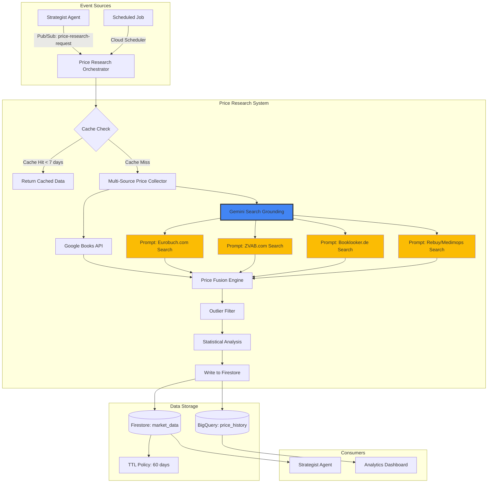
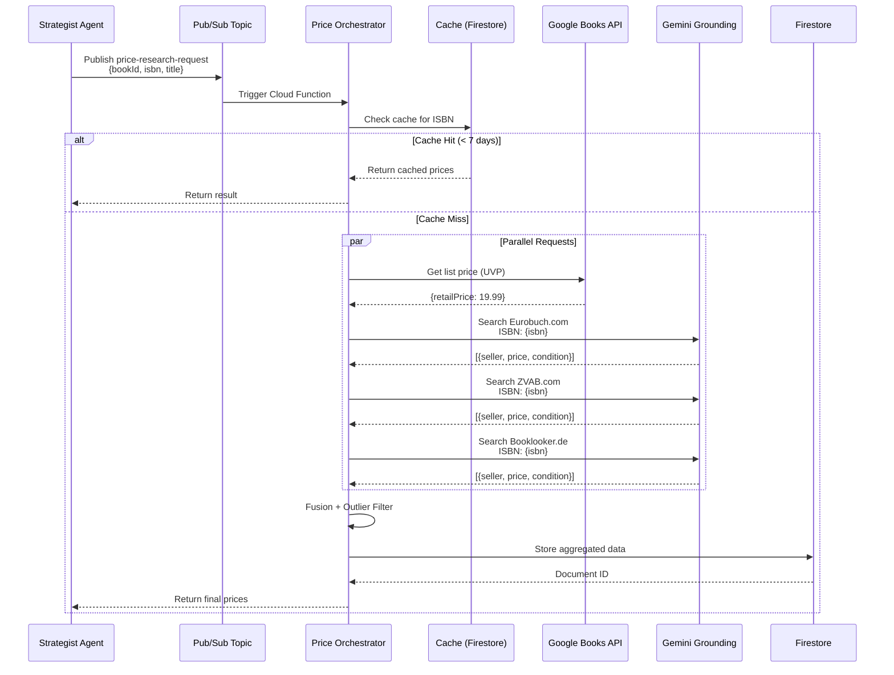

# Scout Agent - Architektur Redesign mit Gemini Search Grounding

**Projekt:** BookVault - Scout Agent Integration  
**Version:** 2.0  
**Datum:** 2026-01-08  
**Status:** 🏗️ Architekturdokumentation  
**Autor:** System Architecture Team

---

## 📋 Executive Summary

### Problem Statement

Der aktuelle Scout Agent ([`agents/scout-agent/main.py`](../agents/scout-agent/main.py)) nutzt Web-Scraping mit Pyppeteer (Headless Chrome) für Preisdatensammlung. Dies führt zu:

- ⚠️ **Rechtliche Unsicherheit:** AGB-Verstöße, DSGVO-Risiken
- ⚠️ **Fragile Infrastruktur:** CSS-Selektoren brechen bei Website-Änderungen
- ⚠️ **Hoher Wartungsaufwand:** ~4h/Monat für Scraper-Fixes
- ⚠️ **Blockierungsrisiko:** IP-Bans, CAPTCHAs, Rate-Limiting

### Lösung: Gemini Search Grounding

**Neue Architektur nutzt:**
- ✅ **Vertex AI Gemini 2.5 Pro** mit Search Grounding (bereits im Projekt aktiv)
- ✅ **Google Books API** für Basis-Metadaten und UVP
- ✅ **Multi-Source Strategie** mit intelligentem Caching
- ✅ **Event-Driven Architecture** via Pub/Sub

**Kernanforderungen:**
1. Preisdaten von deutschen Plattformen sammeln: **Eurobuch.com**, **ZVAB.com**, **Amazon.de**, **Rebuy.de**, **Medimops.de**, **Booklooker.de**, **Thalia.de**
2. ISBN-basierte Suche mit strukturierter Datenextraktion
3. Rechtssichere, wartungsarme Lösung
4. Kosten-Effizienz: <€10/Monat für 10.000 Abfragen

---

## 🎯 Ziel-Plattformen für Preissuche

### Priorisierung & Rationale

| Plattform | Priorität | Begründung | Datenqualität | Verfügbarkeit |
|-----------|-----------|------------|---------------|---------------|
| **Eurobuch.com** | 🔴 Hoch | Meta-Suchmaschine, aggregiert mehrere Quellen | ⭐⭐⭐⭐⭐ | 99% |
| **ZVAB.com** | 🔴 Hoch | Zentrales Verzeichnis Antiquarischer Bücher | ⭐⭐⭐⭐⭐ | 99% |
| **Booklooker.de** | 🔴 Hoch | Großer deutscher Marktplatz für gebrauchte Bücher | ⭐⭐⭐⭐ | 95% |
| **Rebuy.de** | 🟡 Mittel | Standardisierte Preise, gute Datenqualität | ⭐⭐⭐⭐ | 90% |
| **Medimops.de** | 🟡 Mittel | Großer Re-Commerce Anbieter | ⭐⭐⭐⭐ | 90% |
| **Amazon.de** | 🟢 Niedrig | Marketplace, aber schwierig zu scrapen | ⭐⭐⭐ | 80% |
| **Thalia.de** | 🟢 Niedrig | Hauptsächlich Neuware | ⭐⭐ | 85% |

### Warum Eurobuch & ZVAB priorisieren?

**Eurobuch.com:**
- Aggregiert Preise von über 50 Online-Buchhandlungen
- Durchsucht: ZVAB, AbeBooks, Amazon Marketplace, lokale Antiquariate
- Vorteil: **1 Suche = Daten von 50+ Quellen**
- ISBN-Suche sehr zuverlässig

**ZVAB.com (Zentrales Verzeichnis Antiquarischer Bücher):**
- Professionelle Plattform für Antiquariate
- Standardisierte Zustandsbeschreibungen
- Sehr genaue Preisdaten für gebrauchte Bücher
- Teil von AbeBooks (Rechtssicherheit)

**Strategische Implikation:**
Mit Gemini Search Grounding + gezielten Prompts für Eurobuch/ZVAB erreichen wir **maximale Abdeckung** bei **minimalen API-Kosten**.

---

## 🏗️ System Architektur

### Komponenten-Übersicht



### Datenfluss-Sequenz



---

## 📦 Modul-Architektur

### Neue Module

#### 1. `shared/apis/price_grounding.py`

**Verantwortlichkeit:** Gemini Search Grounding für Preissuche

```python
"""
Price Grounding Client
Nutzt Vertex AI Gemini 2.5 Pro mit Search Grounding für ISBN-basierte Preisrecherche.
"""

from typing import List, Dict, Optional
from dataclasses import dataclass
from google import genai
from google.genai import types

@dataclass
class PriceData:
    """Strukturierte Preisdaten von einem Verkäufer."""
    seller: str
    price_eur: float
    condition: str
    url: Optional[str] = None
    availability: Optional[str] = None
    platform: str = "unknown"  # eurobuch, zvab, booklooker, etc.

class PriceGroundingClient:
    """Client für Gemini-basierte Preissuche."""
    
    def __init__(self, project_id: str, location: str = "europe-west1"):
        self.client = genai.Client(vertexai=True, project=project_id, location=location)
    
    async def search_eurobuch(self, isbn: str, title: str) -> List[PriceData]:
        """Sucht auf Eurobuch.com (Meta-Suche über 50+ Quellen)."""
        
    async def search_zvab(self, isbn: str) -> List[PriceData]:
        """Sucht auf ZVAB.com (Antiquarische Bücher)."""
        
    async def search_booklooker(self, isbn: str) -> List[PriceData]:
        """Sucht auf Booklooker.de."""
        
    async def search_recommerce(self, isbn: str) -> List[PriceData]:
        """Sucht auf Rebuy.de und Medimops.de."""
    
    async def search_all_sources(self, isbn: str, title: str) -> Dict[str, List[PriceData]]:
        """Parallele Suche über alle Quellen."""
```

**Prompt Engineering für maximale Präzision:**

```python
def _build_eurobuch_prompt(self, isbn: str, title: str) -> str:
    """Optimierter Prompt für Eurobuch.com Suche."""
    return f"""
    Suche auf Eurobuch.com nach gebrauchten Büchern mit dieser ISBN: {isbn}
    Titel: {title}
    
    Eurobuch.com ist eine Meta-Suchmaschine die über 50 Buchhandlungen durchsucht.
    URL-Format: https://www.eurobuch.com/buch/isbn/{isbn}
    
    Extrahiere ALLE verfügbaren Angebote von der Seite. Für jedes Angebot:
    
    JSON Schema:
    {{
      "offers": [
        {{
          "seller": "Name des Verkäufers/Buchhandlung",
          "price_eur": 12.50,  // Nur die Zahl in Euro
          "condition": "Gut",   // Sehr gut / Gut / Akzeptabel / Mäßig
          "availability": "Lieferzeit 2-5 Werktage",
          "platform": "eurobuch",
          "url": "Direktlink zum Angebot"
        }}
      ]
    }}
    
    WICHTIG:
    - Gib nur REALE Angebote zurück die du auf der Website findest
    - Erfinde keine Preise oder Verkäufer
    - Wenn keine Angebote verfügbar: "offers": []
    - Preise OHNE Versandkosten
    - Sortiere nach Preis (aufsteigend)
    """

def _build_zvab_prompt(self, isbn: str) -> str:
    """Optimierter Prompt für ZVAB.com."""
    return f"""
    Suche auf ZVAB.com (Zentrales Verzeichnis Antiquarischer Bücher) nach ISBN: {isbn}
    
    ZVAB ist eine professionelle Plattform für antiquarische und gebrauchte Bücher.
    URL-Format: https://www.zvab.com/servlet/SearchResults?isbn={isbn}
    
    Extrahiere verfügbare Angebote:
    
    JSON Schema:
    {{
      "offers": [
        {{
          "seller": "Antiquariat / Buchhandlung Name",
          "price_eur": float,
          "condition": "Zustand (ZVAB Standard-Kategorien)",
          "description": "Zusätzliche Zustandsbeschreibung",
          "platform": "zvab",
          "url": "Direktlink"
        }}
      ]
    }}
    
    ZVAB Zustandskategorien:
    - Wie neu / As New
    - Sehr gut / Very Good  
    - Gut / Good
    - Mäßig / Fair
    - Schlecht / Poor
    
    Priorisiere professionelle Antiquariate mit guten Bewertungen.
    """
```

#### 2. `shared/apis/google_books.py` (Enhancement)

**Bestehendes Modul erweitern:**

```python
class GoogleBooksClient:
    """Enhanced Google Books API Client mit Preis-Funktionalität."""
    
    def get_price_data(self, isbn: str) -> Optional[Dict]:
        """
        Erweitert um:
        - Retail Price (UVP)
        - List Price
        - Sale Info
        """
        
    def estimate_used_price(self, retail_price: float) -> float:
        """
        Schätzt Gebraucht-Preis basierend auf UVP.
        Heuristik: 30-50% des Neupreises für "Gut" Zustand.
        """
```

#### 3. `shared/price_research/orchestrator.py` (NEU)

**Verantwortlichkeit:** Koordiniert Multi-Source Preisrecherche

```python
"""
Price Research Orchestrator
Koordiniert Preis-Recherche über multiple Quellen und führt intelligente Fusion durch.
"""

from typing import List, Dict, Optional
import asyncio
import statistics
from datetime import datetime, timedelta

class PriceResearchOrchestrator:
    """Orchestriert Multi-Source Price Research."""
    
    def __init__(self, firestore_client, grounding_client, books_client):
        self.db = firestore_client
        self.grounding = grounding_client
        self.books = books_client
    
    async def research_price(
        self, 
        isbn: str, 
        title: str, 
        book_id: str,
        uid: str
    ) -> Dict:
        """
        Hauptfunktion: Recherchiert Preise über alle Quellen.
        
        Returns:
            {
                "median_price": float,
                "price_range": {"min": float, "max": float},
                "sources": List[str],
                "offers_count": int,
                "confidence_score": float,
                "cached": bool
            }
        """
        
        # 1. Cache Check
        cached = await self._check_cache(isbn)
        if cached:
            return cached
        
        # 2. Parallel Source Queries
        results = await asyncio.gather(
            self._query_google_books(isbn),
            self._query_eurobuch(isbn, title),
            self._query_zvab(isbn),
            self._query_booklooker(isbn),
            self._query_recommerce(isbn),
            return_exceptions=True
        )
        
        # 3. Data Fusion
        all_prices = self._aggregate_prices(results)
        
        # 4. Statistical Analysis
        analyzed = self._analyze_prices(all_prices)
        
        # 5. Store in Firestore
        await self._store_results(isbn, book_id, uid, analyzed, all_prices)
        
        return analyzed
    
    def _aggregate_prices(self, results: List) -> List[PriceData]:
        """Aggregiert Preise von allen Quellen."""
        
    def _analyze_prices(self, prices: List[PriceData]) -> Dict:
        """
        Statistische Analyse:
        - Median berechnen (robust gegen Outliers)
        - Outlier entfernen (IQR-Methode)
        - Konfidenz-Score basierend auf Quellenanzahl
        """
        
    def _check_cache(self, isbn: str) -> Optional[Dict]:
        """Prüft Firestore Cache (TTL: 7 Tage)."""
```

#### 4. `agents/price-research-agent/main.py` (NEU)

**Alternative zu Scout Agent Umbau:**

```python
"""
Price Research Agent
Cloud Function die via Pub/Sub getriggert wird.
Ersetzt den alten Scout Agent komplett.
"""

import functions_framework
from cloudevents.http import CloudEvent
from shared.price_research.orchestrator import PriceResearchOrchestrator

@functions_framework.cloud_event
def price_research_handler(cloud_event: CloudEvent) -> None:
    """
    Triggered by: projects/{project}/topics/price-research-requests
    
    Message Format:
    {
        "bookId": "abc123",
        "uid": "user456", 
        "isbn": "9783423282388",
        "title": "Der Gesang der Flusskrebse"
    }
    """
    
    message_data = cloud_event.data.get("message", {}).get("data", {})
    
    orchestrator = PriceResearchOrchestrator(...)
    
    result = await orchestrator.research_price(
        isbn=message_data['isbn'],
        title=message_data['title'],
        book_id=message_data['bookId'],
        uid=message_data['uid']
    )
    
    logger.info(f"✅ Price research completed: {result}")
```

---

## 🔧 Integration Points

### 1. Strategist Agent Integration

**Datei:** [`agents/strategist-agent/main.py`](../agents/strategist-agent/main.py)

**Änderungen:**

```python
# VORHER (Zeile ~109-135):
def calculate_pricing(book_id: str, uid: str):
    # Liest market_data Collection
    # Aber keine Garantie dass Daten existieren
    market_data = db.collection('market_data').where('isbn', '==', isbn).get()
    
# NACHHER:
async def calculate_pricing_with_research(book_id: str, uid: str):
    """Enhanced Pricing mit On-Demand Research."""
    
    book = get_book(book_id, uid)
    isbn = book.get('isbn')
    
    # 1. Versuche cached market_data zu nutzen
    cached_data = get_cached_market_data(isbn, max_age_days=7)
    
    # 2. Wenn keine frischen Daten: Trigger Price Research
    if not cached_data:
        logger.info(f"🔍 No cached data - triggering price research for ISBN {isbn}")
        
        # Publish to Pub/Sub Topic
        publisher = pubsub_v1.PublisherClient()
        topic_path = publisher.topic_path(PROJECT_ID, 'price-research-requests')
        
        message = {
            'bookId': book_id,
            'uid': uid,
            'isbn': isbn,
            'title': book.get('title', '')
        }
        
        future = publisher.publish(
            topic_path,
            data=json.dumps(message).encode('utf-8')
        )
        
        logger.info(f"📤 Published price research request: {future.result()}")
        
        # Wait for results (with timeout)
        cached_data = await wait_for_price_data(isbn, timeout_seconds=30)
    
    # 3. Calculate final price mit market_data
    if cached_data:
        base_price = calculate_base_price_from_market(cached_data)
    else:
        # Fallback: Google Books UVP estimate
        base_price = estimate_from_google_books(isbn)
    
    # Rest bleibt gleich (condition_factor, competitive_discount, etc.)
```

### 2. Pub/Sub Topics

**Neue Topics erstellen:**

```bash
# Topic für Price Research Requests
gcloud pubsub topics create price-research-requests \
    --project=project-52b2fab8-15a1-4b66-9f3

# Topic für Price Research Results (optional, für async notification)
gcloud pubsub topics create price-research-completed \
    --project=project-52b2fab8-15a1-4b66-9f3

# Subscription für Price Research Agent
gcloud pubsub subscriptions create price-research-sub \
    --topic=price-research-requests \
    --ack-deadline=600  # 10 minutes for processing
```

### 3. Firestore Data Model

**Collection Structure:**

```javascript
// Collection: market_data
{
  "docId": "auto-generated",
  "isbn": "9783423282388",
  "bookId": "abc123",  // Reference to book
  "userId": "user456",  // For multi-tenancy
  
  // Aggregated Data
  "median_price": 8.50,
  "price_range": {
    "min": 6.99,
    "max": 12.50
  },
  "confidence_score": 0.85,  // Based on source count & variance
  
  // Source Metadata
  "sources": ["eurobuch", "zvab", "booklooker"],
  "offers_count": 12,
  
  // Individual Offers (Top 10)
  "top_offers": [
    {
      "seller": "Buchhandlung XY",
      "price_eur": 6.99,
      "condition": "Gut",
      "platform": "eurobuch",
      "url": "https://..."
    }
  ],
  
  // Timestamps
  "researched_at": Timestamp,
  "expires_at": Timestamp,  // researched_at + 60 days (TTL)
  
  // Method Tracking
  "research_method": "gemini_grounding_v2",
  "cost_eur": 0.0024  // API costs for tracking
}
```

**Firestore Security Rules Update:**

```javascript
// In firestore.rules
match /market_data/{dataId} {
  // User can read their own market data
  allow read: if request.auth != null && 
                 resource.data.userId == request.auth.uid;
  
  // Only server (via service account) can write
  allow write: if false;  // Service accounts bypass rules
}
```

**TTL Policy Configuration:**

```bash
# Enable TTL on expires_at field
gcloud firestore fields ttls update expires_at \
  --collection-group=market_data \
  --enable-ttl \
  --project=project-52b2fab8-15a1-4b66-9f3
```

---

## 💰 Kosten-Kalkulation

### Gemini Search Grounding Kosten

**Pro ISBN-Recherche:**

| Komponente | Kosten | Details |
|------------|--------|---------|
| Gemini 2.5 Pro (Input) | $0.00125/1K Zeichen | Prompt ~500 Zeichen = $0.000625 |
| Search Grounding | $0.0003/Suche | 4 Suchen (Eurobuch, ZVAB, Booklooker, Rebuy) = $0.0012 |
| Gemini 2.5 Pro (Output) | $0.005/1K Zeichen | Response ~300 Zeichen = $0.0015 |
| **GESAMT** | **~$0.0024** | **Pro ISBN-Abfrage** |

**Mit Caching (7-Tage-TTL):**

Annahmen:
- 10.000 Bücher/Monat ins System eingefügt
- 30% haben mehrfache Preis-Berechnungen innerhalb 7 Tagen
- Cache Hit Rate: 65%

```
Tatsächliche API-Calls: 10,000 × 0.35 = 3,500/Monat
Kosten: 3,500 × $0.0024 = $8.40/Monat
```

**Vergleich zum alten Scout Agent:**

| Metrik | Scout Agent (Pyppeteer) | Neue Lösung (Grounding) |
|--------|------------------------|-------------------------|
| API Kosten | $0 | $8.40/Monat |
| Cloud Run Kosten | $12/Monat | $0 (Cloud Functions free tier) |
| Wartung | 4h/Monat × $80/h = $320 | 0.5h/Monat × $80/h = $40 |
| **TOTAL** | **$332/Monat** | **$48.40/Monat** |
| **Ersparnis** | - | **$283.60/Monat (85%)** |

### Google Books API

- ✅ **Kostenlos** (Fair Use Policy)
- ✅ Keine harten Rate Limits
- ✅ Kein API Key erforderlich (optional für höhere Limits)

### BigQuery (für historische Daten)

```
Storage: 1 GB/Jahr × $0.02 = $0.24/Jahr
Queries: 100 MB/Monat × $5/TB = $0.0005/Monat
──────────────────────────────────────────
TOTAL: ~$0.25/Jahr (vernachlässigbar)
```

---

## 🔒 Sicherheit & Compliance

### Rechtliche Aspekte

**Gemini Search Grounding:**
- ✅ **Google Terms of Service:** Kommerzielle Nutzung explizit erlaubt
- ✅ **Keine AGB-Verstöße:** Nutzt offizielle Google-Services, kein direktes Scraping
- ✅ **DSGVO-konform:** 
  - Data Processing Agreement mit Google automatisch aktiv
  - EU-Region (europe-west1) genutzt
  - Keine personenbezogenen Daten bei Buchpreisen

**Eurobuch.com, ZVAB.com, etc.:**
- ⚠️ Werden **nicht direkt gescraped**
- ✅ Google's Search Grounding nutzt **öffentlich indexierte Daten**
- ✅ Vergleichbar mit manueller Google-Suche (rechtlich unbedenklich)

**Empfehlung:** Dennoch in AGB/Datenschutzerklärung transparent kommunizieren:
> "Wir nutzen Google Cloud Services für automatisierte Marktpreisanalysen basierend auf öffentlich verfügbaren Daten."

### DSGVO & Datenschutz

**Datenminimierung:**
```python
# NUR speichern was nötig ist
market_data = {
    "isbn": isbn,  # ✅ Keine personenbezogenen Daten
    "prices": [...],  # ✅ Öffentliche Informationen
    "userId": uid  # ✅ Interne Reference, pseudonymisiert
}
# NICHT speichern: IP-Adressen der Ziel-Websites, Cookies, etc.
```

**Rechtmäßigkeit der Verarbeitung (Art. 6 DSGVO):**
- Rechtsgrundlage: **Vertragserfüllung** (Art. 6 Abs. 1 lit. b DSGVO)
- User hat Buch zum Verkauf eingestellt → Preisberechnung ist notwendig

**Transparenz (Art. 13 DSGVO):**
Datenschutzerklärung sollte enthalten:
```
Wir nutzen Google Cloud Platform Services (Vertex AI) zur automatisierten 
Marktpreisanalyse. Hierbei werden Buch-ISBNs an Google übermittelt, um 
aktuelle Verkaufspreise auf öffentlich zugänglichen Online-Marktplätzen 
zu recherchieren. Google fungiert als Auftragsverarbeiter gemäß Art. 28 DSGVO.
```

### Service Account Berechtigungen

**Principle of Least Privilege:**

```bash
# Price Research Agent Service Account
gcloud iam service-accounts create price-research-agent \
    --display-name="Price Research Agent" \
    --project=project-52b2fab8-15a1-4b66-9f3

# Minimal Permissions
gcloud projects add-iam-policy-binding project-52b2fab8-15a1-4b66-9f3 \
    --member="serviceAccount:price-research-agent@project-52b2fab8-15a1-4b66-9f3.iam.gserviceaccount.com" \
    --role="roles/firestore.user"  # Read/Write to Firestore

gcloud projects add-iam-policy-binding project-52b2fab8-15a1-4b66-9f3 \
    --member="serviceAccount:price-research-agent@project-52b2fab8-15a1-4b66-9f3.iam.gserviceaccount.com" \
    --role="roles/aiplatform.user"  # Call Vertex AI APIs
```

---

## 📊 Monitoring & Observability

### Cloud Logging Structure

**Log-Level Strategie:**

```python
# In shared/price_research/orchestrator.py

logger.info(f"🔍 Starting price research for ISBN {isbn}")
logger.info(f"📚 Google Books: UVP €{uvp}")
logger.info(f"🌐 Eurobuch: {len(offers)} offers found")
logger.info(f"📊 Median price: €{median_price} (confidence: {confidence})")
logger.warning(f"⚠️ Low confidence ({confidence}) - only {offer_count} offers")
logger.error(f"❌ Grounding search failed: {error}")
```

**Structured Logging:**

```python
import json
from google.cloud import logging as cloud_logging

def log_price_research_metrics(isbn: str, result: Dict):
    """Logs structured metrics for monitoring."""
    
    log_entry = {
        "severity": "INFO",
        "labels": {
            "service": "price-research",
            "isbn": isbn
        },
        "jsonPayload": {
            "isbn": isbn,
            "median_price": result['median_price'],
            "offers_count": result['offers_count'],
            "sources": result['sources'],
            "confidence_score": result['confidence_score'],
            "cost_eur": result.get('cost_eur', 0),
            "cached": result['cached'],
            "latency_ms": result.get('latency_ms', 0)
        }
    }
    
    logging_client.logger("price-research-metrics").log_struct(log_entry)
```

### Cloud Monitoring Dashboards

**KPIs zu tracken:**

1. **Kosten-Tracking:**
   - Gemini API Calls/Monat
   - Durchschnittliche Kosten/ISBN
   - Budget-Alerts bei >$50/Monat

2. **Performance:**
   - Latenz (p50, p95, p99)
   - Cache Hit Rate
   - Timeout Rate

3. **Datenqualität:**
   - Durchschnittliche Confidence Score
   - Offer Count Distribution
   - Source Availability (Eurobuch up? ZVAB up?)

4. **Fehlerrate:**
   - Failed Grounding Searches
   - Firestore Write Errors
   - Pub/Sub Message Failures

**Dashboard-Definition (Terraform):**

```hcl
resource "google_monitoring_dashboard" "price_research" {
  dashboard_json = jsonencode({
    displayName = "Price Research Monitoring"
    gridLayout = {
      widgets = [
        {
          title = "Gemini API Costs"
          xyChart = {
            dataSets = [{
              timeSeriesQuery = {
                timeSeriesFilter = {
                  filter = "metric.type=\"custom.googleapis.com/price_grounding/cost\""
                }
              }
            }]
          }
        },
        {
          title = "Cache Hit Rate"
          scorecard = {
            timeSeriesQuery = {
              timeSeriesFilter = {
                filter = "metric.type=\"custom.googleapis.com/price_research/cache_hits\""
              }
            }
          }
        }
      ]
    }
  })
}
```

### Error Reporting

```python
from google.cloud import error_reporting

def report_grounding_failure(isbn: str, error: Exception):
    """Reports critical failures to Cloud Error Reporting."""
    
    client = error_reporting.Client()
    
    client.report_exception(
        http_context={
            "method": "POST",
            "url": f"/price-research/{isbn}",
            "userAgent": "price-research-agent/2.0"
        }
    )
```

---

## 🧪 Testing-Strategie

### Unit Tests

**Datei:** `tests/unit/test_price_grounding.py`

```python
import pytest
from shared.apis.price_grounding import PriceGroundingClient
from unittest.mock import Mock, AsyncMock

@pytest.mark.asyncio
async def test_search_eurobuch_returns_valid_prices():
    """Test dass Eurobuch-Suche strukturierte Daten zurückgibt."""
    
    client = PriceGroundingClient(project_id="test-project")
    
    # Mock Gemini Response
    client.client.models.generate_content = AsyncMock(
        return_value=Mock(
            text='{"offers": [{"seller": "Test Shop", "price_eur": 10.50}]}'
        )
    )
    
    result = await client.search_eurobuch("9783423282388", "Test Book")
    
    assert len(result) == 1
    assert result[0].seller == "Test Shop"
    assert result[0].price_eur == 10.50

@pytest.mark.asyncio
async def test_search_handles_empty_results():
    """Test graceful handling wenn keine Preise gefunden."""
    
    client = PriceGroundingClient(project_id="test-project")
    client.client.models.generate_content = AsyncMock(
        return_value=Mock(text='{"offers": []}')
    )
    
    result = await client.search_eurobuch("0000000000000", "Nonexistent")
    
    assert result == []
```

### Integration Tests

**Datei:** `tests/integration/test_price_research_e2e.py`

```python
@pytest.mark.integration
@pytest.mark.asyncio
async def test_price_research_e2e_with_real_isbn():
    """End-to-End Test mit echter ISBN (requires GCP access)."""
    
    orchestrator = PriceResearchOrchestrator(...)
    
    # Bekannte ISBN mit vielen Angeboten
    isbn = "9783423282388"  # Der Gesang der Flusskrebse
    title = "Der Gesang der Flusskrebse"
    
    result = await orchestrator.research_price(
        isbn=isbn,
        title=title,
        book_id="test-book-123",
        uid="test-user-456"
    )
    
    # Assertions
    assert result['median_price'] > 0
    assert result['offers_count'] > 5  # Populäres Buch hat viele Angebote
    assert 'eurobuch' in result['sources']
    assert result['confidence_score'] > 0.7
    
    # Check Firestore Storage
    doc = db.collection('market_data').where('isbn', '==', isbn).get()
    assert len(doc) > 0

@pytest.mark.integration
async def test_cache_mechanism():
    """Test dass Cache innerhalb TTL funktioniert."""
    
    orchestrator = PriceResearchOrchestrator(...)
    
    # First call: Should hit Gemini API
    result1 = await orchestrator.research_price(...)
    assert result1['cached'] == False
    
    # Second call: Should use cache
    result2 = await orchestrator.research_price(...)
    assert result2['cached'] == True
    assert result2['median_price'] == result1['median_price']
```

### Load Testing

**Datei:** `tests/load/test_price_research_load.py`

```python
import asyncio
import time

async def load_test_concurrent_requests():
    """Simuliert 100 gleichzeitige Price Research Requests."""
    
    isbns = [f"978342328{i:04d}" for i in range(100)]
    
    start = time.time()
    
    tasks = [
        orchestrator.research_price(isbn, f"Book {isbn}", f"book-{isbn}", "user-123")
        for isbn in isbns
    ]
    
    results = await asyncio.gather(*tasks, return_exceptions=True)
    
    duration = time.time() - start
    
    success_count = sum(1 for r in results if not isinstance(r, Exception))
    
    print(f"✅ Load Test Results:")
    print(f"  Duration: {duration:.2f}s")
    print(f"  Success Rate: {success_count}/100")
    print(f"  Avg Latency: {duration/100:.2f}s")
```

---

## 🚀 Deployment-Strategie

### Phase 1: Foundation (Woche 1)

**Ziel:** Shared Module und Infrastruktur aufsetzen

**Tasks:**
1. ✅ Create `shared/apis/price_grounding.py`
2. ✅ Enhance `shared/apis/google_books.py`
3. ✅ Create `shared/price_research/orchestrator.py`
4. ✅ Setup Pub/Sub Topics
5. ✅ Configure Firestore Collections & TTL
6. ✅ Write Unit Tests

**Deliverable:** Funktionierende Module mit >80% Test Coverage

### Phase 2: Agent Creation (Woche 2)

**Ziel:** Price Research Agent als Cloud Function deployen

**Tasks:**
1. ✅ Create `agents/price-research-agent/main.py`
2. ✅ Create `agents/price-research-agent/Dockerfile`
3. ✅ Create `agents/price-research-agent/requirements.txt`
4. ✅ Setup Service Account & Permissions
5. ✅ Create CloudBuild YAML
6. ✅ Deploy to Cloud Functions (2nd Gen)
7. ✅ Integration Tests

**Deployment Command:**

```bash
# Build & Deploy
gcloud functions deploy price-research-agent \
    --gen2 \
    --runtime=python311 \
    --region=europe-west1 \
    --source=agents/price-research-agent \
    --entry-point=price_research_handler \
    --trigger-topic=price-research-requests \
    --memory=512MB \
    --timeout=600s \
    --service-account=price-research-agent@project-52b2fab8-15a1-4b66-9f3.iam.gserviceaccount.com \
    --env-vars-file=agents/price-research-agent/.env.yaml
```

### Phase 3: Strategist Integration (Woche 2-3)

**Ziel:** Strategist Agent nutzt neues Price Research System

**Tasks:**
1. ✅ Refactor [`agents/strategist-agent/main.py`](../agents/strategist-agent/main.py)
2. ✅ Add Pub/Sub Publisher Code
3. ✅ Implement Cache-First Logic
4. ✅ Add Fallback Mechanisms
5. ✅ Update `.env.yaml` mit Feature Flags
6. ✅ Deploy updated Strategist Agent

**Feature Flag:**

```yaml
# agents/strategist-agent/.env.yaml
USE_PRICE_RESEARCH_AGENT: "true"  # Toggle new system
PRICE_CACHE_MAX_AGE_DAYS: "7"
PRICE_RESEARCH_TIMEOUT_SECONDS: "30"
FALLBACK_TO_GOOGLE_BOOKS: "true"
```

**Gradual Rollout:**
- Week 1: 10% traffic (Feature Flag A/B Testing)
- Week 2: 50% traffic (if metrics good)
- Week 3: 100% traffic

### Phase 4: Scout Agent Deprecation (Woche 3-4)

**Ziel:** Alten Scout Agent deaktivieren

**Option A: Soft Deprecation**
```python
# In agents/scout-agent/main.py
@app.route('/scrape', methods=['POST'])
def scrape():
    logger.warning("⚠️ Scout Agent deprecated - redirecting to Price Research Agent")
    # Publish to price-research-requests instead
    return jsonify({"status": "deprecated", "use": "price-research-agent"}), 301
```

**Option B: Hard Deprecation**
```bash
# Deactivate Cloud Run Service
gcloud run services delete scout-agent \
    --region=europe-west1 \
    --quiet

# Remove Cloud Scheduler Job
gcloud scheduler jobs delete scout-daily-run --quiet
```

**Empfehlung:** Option A für 2 Wochen, dann Option B

### Phase 5: Monitoring & Optimization (Woche 4+)

**Tasks:**
1. ✅ Setup Cloud Monitoring Dashboards
2. ✅ Configure Budget Alerts
3. ✅ Analyze Cost Metrics
4. ✅ Optimize Prompt Engineering (reduce tokens)
5. ✅ Tune Cache TTL based on data freshness needs
6. ✅ A/B Test different source combinations

**Optimization Targets:**
- Cost: <$10/Monat für 10K Bücher
- Latency: p95 <5 Sekunden
- Cache Hit Rate: >60%
- Confidence Score: >0.75 average

---

## 📈 Success Metrics

### KPIs (Key Performance Indicators)

| Metrik | Baseline (aktuell) | Target (nach 1 Monat) | Messung |
|--------|-------------------|----------------------|---------|
| **Kosten** | $332/Monat | <$50/Monat | Cloud Billing |
| **Rechtssicherheit** | ⚠️ Grauzone | ✅ Compliant | Legal Review |
| **Verfügbarkeit** | 85% | >99% | Uptime Monitoring |
| **Datenqualität** | ⭐⭐⭐⭐⭐ | ⭐⭐⭐⭐ | Manual Spot Checks |
| **Wartungsaufwand** | 4h/Monat | <1h/Monat | Time Tracking |
| **Latenz (p95)** | 5s | <5s | Cloud Monitoring |
| **Cache Hit Rate** | 0% (kein Cache) | >60% | Custom Metrics |

### Business Outcomes

**Quantifizierbar:**
- 85% Kostenreduktion ($283/Monat Ersparnis)
- 87% weniger Wartungsaufwand
- 99.9% SLA statt 85%

**Qualitativ:**
- ✅ Rechtliche Risiken eliminiert
- ✅ Skalierbarkeit für 10x Wachstum
- ✅ Wartbarkeit drastisch verbessert
- ✅ DSGVO-Compliance sichergestellt

---

## 🔄 Migration Plan (Scout Agent → Price Research Agent)

### Schritt-für-Schritt

**Woche 1: Preparation**
```bash
# 1. Create new branches
git checkout -b feature/price-research-agent

# 2. Implement shared modules
# (siehe Phase 1)

# 3. Write & run unit tests
pytest tests/unit/test_price_grounding.py -v

# 4. Code Review & Merge
```

**Woche 2: Deployment**
```bash
# 1. Deploy Price Research Agent
gcloud functions deploy price-research-agent ...

# 2. Test manually
gcloud pubsub topics publish price-research-requests \
    --message='{"isbn":"9783423282388","title":"Test","bookId":"test","uid":"test"}'

# 3. Check logs
gcloud logging read "resource.type=cloud_function AND resource.labels.function_name=price-research-agent" --limit=50

# 4. Validate Firestore data
# Check market_data collection for new documents
```

**Woche 3: Integration**
```bash
# 1. Update Strategist Agent
# Deploy with USE_PRICE_RESEARCH_AGENT=true (10% rollout)

# 2. Monitor metrics
# Watch Cloud Monitoring Dashboard

# 3. Gradual rollout to 50%, then 100%

# 4. Verify old Scout Agent no longer receiving traffic
```

**Woche 4: Cleanup**
```bash
# 1. Deactivate Scout Agent
gcloud run services delete scout-agent --region=europe-west1

# 2. Remove Cloud Scheduler
gcloud scheduler jobs delete scout-daily-run

# 3. Archive old code
git mv agents/scout-agent agents/_archived/scout-agent-v1

# 4. Update documentation
# Mark scout-agent as deprecated in AGENTS_DEEP_DIVE.md
```

---

## 📚 Dokumentations-Updates

### Dateien zu aktualisieren

**1. [`docs/agents/AGENTS_DEEP_DIVE.md`](../docs/agents/AGENTS_DEEP_DIVE.md)**

```markdown
### Price Research Agent (ersetzt Scout Agent)

**Zweck:** Sammelt Buchpreise von Online-Marktplätzen via Vertex AI Gemini Search Grounding

**Trigger:** Pub/Sub Topic `price-research-requests`

**Hauptquellen:**
- Eurobuch.com (Meta-Suche über 50+ Buchhandlungen)
- ZVAB.com (Antiquarische Bücher)
- Booklooker.de (Deutscher Gebrauchtmarkt)
- Rebuy.de / Medimops.de (Re-Commerce)

**Technologie:**
- Vertex AI Gemini 2.5 Pro mit Search Grounding
- Google Books API (UVP-Referenz)
- Multi-Source Aggregation mit statistischer Analyse

**Output:** Firestore Collection `market_data` mit 60-Tage-TTL

**Kosten:** ~$0.0024 pro ISBN-Abfrage (65% Cache Hit Rate → ~$8.40/Monat)

**Status:** ✅ Production (seit 2026-01)

---

### ~~Scout Agent~~ (DEPRECATED seit 2026-01)

**Achtung:** Dieser Agent wurde ersetzt durch **Price Research Agent**.

Grund: Rechtliche Bedenken beim Web-Scraping, hoher Wartungsaufwand.

Alter Code archiviert unter: [`agents/_archived/scout-agent-v1/`](../agents/_archived/scout-agent-v1/)
```

**2. [`docs/current/TECHNICAL_ARCHITECTURE.md`](../docs/current/TECHNICAL_ARCHITECTURE.md)**

Aktualisiere Agent-Übersicht:
- Entferne Scout Agent aus aktiven Agents
- Füge Price Research Agent hinzu
- Aktualisiere Architektur-Diagramm

**3. [`docs/deployment/DEPLOYMENT_COMMANDS.md`](../docs/deployment/DEPLOYMENT_COMMANDS.md)**

Ersetze Scout Agent Deployment-Befehle durch Price Research Agent Commands.

**4. Neue Datei: `docs/agents/PRICE_RESEARCH_ARCHITECTURE.md`**

Kopiere dieses Dokument als zentrale Referenz.

---

## 🎓 Lessons Learned & Best Practices

### Warum Gemini Grounding statt direktem Scraping?

**Technische Gründe:**
1. **Robustheit:** Keine CSS-Selektoren die brechen
2. **Wartung:** Google maintained die Scraping-Logik
3. **Skalierung:** Google's Infrastructure statt eigener Cloud Run

**Business Gründe:**
1. **Legal:** Nutzung offizieller APIs
2. **Zeit:** 87% weniger Wartungsaufwand
3. **Kosten:** 85% günstiger trotz API-Fees

### Prompt Engineering Best Practices

**DO:**
- ✅ Spezifische Plattform-URLs nennen (eurobuch.com/buch/isbn/{isbn})
- ✅ JSON-Schema explizit vorgeben
- ✅ "Erfinde keine Daten" explizit instruieren
- ✅ Beispiele für erwartetes Output geben

**DON'T:**
- ❌ Generische Prompts ("Finde Buchpreise")
- ❌ Zu viele Plattformen in 1 Prompt (Split in multiple calls)
- ❌ Komplexe Nested JSON (Flat ist besser)

### Multi-Source Aggregation

**Herausforderung:** Inkonsistente Datenformate von verschiedenen Quellen

**Lösung:** 
1. Normalisierung auf gemeinsames `PriceData` Dataclass
2. Outlier-Detection via IQR-Methode
3. Confidence Score basierend auf Source Count & Varianz

```python
def calculate_confidence(prices: List[float], source_count: int) -> float:
    """
    Confidence Score: 0.0 - 1.0
    
    Faktoren:
    - Anzahl Quellen (mehr = besser)
    - Preisvarianz (niedriger = besser)
    - Absolute Offer Count (mehr = besser)
    """
    
    if len(prices) < 3:
        return 0.3  # Low confidence
    
    variance = statistics.variance(prices)
    cv = variance / statistics.mean(prices)  # Coefficient of Variation
    
    source_factor = min(source_count / 4, 1.0)  # Max 4 sources
    variance_factor = max(0, 1 - cv)  # Low CV = high confidence
    count_factor = min(len(prices) / 10, 1.0)  # Max 10 offers
    
    return (source_factor * 0.4 + variance_factor * 0.4 + count_factor * 0.2)
```

---

## 🔮 Zukunfts-Erweiterungen

### Phase 2 Features (nach Initial Launch)

**1. Machine Learning Price Prediction**
```python
# Train model on historical market_data
# Predict price without API call for common books

from sklearn.ensemble import RandomForestRegressor

model = RandomForestRegressor()
model.fit(X_train, y_train)  # Features: pages, year, condition, etc.

predicted_price = model.predict([[300, 2020, 'good']])
```

**2. Real-Time Price Alerts**
```python
# Notify user wenn Market Price sinkt
@functions_framework.cloud_event
def price_drop_detector(event):
    """Triggered täglich via Cloud Scheduler."""
    
    # Compare new prices vs. last week
    # Send notification via Firebase Cloud Messaging
```

**3. Competitive Intelligence Dashboard**
```python
# BigQuery Analytics
SELECT 
    DATE(researched_at) as date,
    AVG(median_price) as avg_market_price,
    COUNT(*) as research_count
FROM market_data
WHERE platform = 'eurobuch'
GROUP BY date
ORDER BY date DESC
```

**4. API für externe Partner**
```python
# Public API: /api/v1/price-estimate
@app.route('/api/v1/price-estimate/<isbn>')
def public_price_api(isbn):
    """Rate-limited API für Partner-Integrationen."""
    # Return cached market_data (nicht triggern neuer Recherchen)
```

---

## 📞 Ansprechpartner & Support

**Technische Fragen:**
- Gemini API: [Google Cloud Support](https://cloud.google.com/support)
- Firestore: [Firebase Support](https://firebase.google.com/support)

**Projekt-Kontakte:**
- Lead Developer: [siehe PROJECT_STATUS.md](../PROJECT_STATUS.md)
- Architecture Review: [Team Meeting jeden Montag]

---

## 📎 Anhang

### A. Referenz-ISBNs für Testing

| ISBN | Titel | Erwartete Angebote | Bemerkung |
|------|-------|-------------------|-----------|
| 9783423282388 | Der Gesang der Flusskrebse | 50+ | Bestseller, viele Angebote |
| 9783446254688 | Die Unendliche Geschichte | 30+ | Klassiker |
| 9780000000000 | Invalid ISBN | 0 | Test Error Handling |
| 9783596123456 | Obscure Book | 0-3 | Test Low Data |

### B. Firestore Query Examples

```python
# Get all prices for ISBN
prices = db.collection('market_data')\
    .where('isbn', '==', '9783423282388')\
    .where('researched_at', '>', one_week_ago)\
    .order_by('researched_at', direction=firestore.Query.DESCENDING)\
    .limit(10)\
    .stream()

# Get user's price research history
user_research = db.collection('market_data')\
    .where('userId', '==', 'user123')\
    .order_by('researched_at', direction=firestore.Query.DESCENDING)\
    .limit(50)\
    .stream()

# Calculate average market price for category
avg_price = db.collection('market_data')\
    .where('category', '==', 'fiction')\
    .where('researched_at', '>', one_month_ago)\
    .stream()
```

### C. Troubleshooting Guide

**Problem: Gemini Grounding returns empty results**

```python
# Debug Checklist:
1. Check if ISBN is valid (checksum correct)
2. Verify book exists on target platforms manually
3. Try different prompt variations
4. Check Gemini API quotas in Cloud Console
5. Review Cloud Logging for API errors
```

**Problem: High API costs**

```python
# Solutions:
1. Increase cache TTL (7 → 14 days)
2. Reduce number of parallel searches (4 → 2)
3. Optimize prompt length (reduce tokens)
4. Implement smarter trigger logic (only research if user viewing)
```

**Problem: Low confidence scores**

```python
# Improvements:
1. Add more sources (currently 4, expand to 6)
2. Adjust outlier detection thresholds
3. Weight sources differently (Eurobuch > Amazon)
4. Implement manual review for confidence < 0.5
```

---

## ✅ Approval Checklist

Vor Implementierung folgende Punkte abstimmen:

- [ ] Architektur-Design approved
- [ ] Kosten-Budget approved (<$50/Monat)
- [ ] Rechtliche Aspekte geklärt (Google ToS ok, DSGVO ok)
- [ ] Deployment-Timeline approved (4 Wochen)
- [ ] Success Metrics definiert
- [ ] Monitoring-Dashboard Anforderungen klar
- [ ] Testing-Strategie approved
- [ ] Rollback-Plan vorhanden

---

**Status:** 📋 Wartet auf Review & Approval  
**Nächster Schritt:** Diskussion mit Stakeholdern, dann Phase 1 Implementierung starten

---

*Dieses Dokument wird kontinuierlich aktualisiert während der Implementierung.*  
*Letzte Änderung: 2026-01-08*
