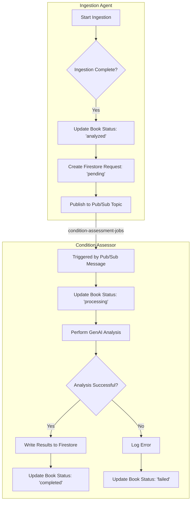

# Refactoring Plan: Asynchronous Condition Assessment

**Author:** Roo, Architect Agent
**Date:** 2025-12-07

## 1. Executive Summary

This document outlines the plan to refactor the communication between the `ingestion-agent` and the `condition-assessor` from a synchronous, blocking HTTP-based workflow to a fully asynchronous, event-driven architecture using Google Cloud Pub/Sub.

This change will resolve critical timeout issues, improve system resilience, and enhance scalability.

## 2. Current State Analysis

- **`ingestion-agent`**: After completing its primary ingestion tasks, it calls the `condition-assessor` via a blocking `requests.post()` call with a 120-second timeout. This call waits for the entire condition analysis to complete.
- **`condition-assessor`**: It's an HTTP-triggered Cloud Function. The analysis, which involves calls to the Gemini LLM, is performed entirely within the lifecycle of the incoming HTTP request. The long processing time frequently exceeds the caller's timeout threshold, leading to failures and retries.

This synchronous coupling is inefficient and not resilient.

## 3. Proposed Architecture: Pub/Sub Integration

We will decouple the services by introducing a Pub/Sub topic as an intermediary message bus.



### Workflow Steps:
1.  The `ingestion-agent` successfully processes a book.
2.  It creates a `condition_assessment_request` document in Firestore with an initial status of `pending`.
3.  It then publishes a message containing `{ "book_id", "user_id", "image_urls" }` to a new Pub/Sub topic named `condition-assessment-jobs`.
4.  The `ingestion-agent`'s work is now done, and it can terminate successfully.
5.  A new, Pub/Sub-triggered `condition-assessor` function is invoked by the message.
6.  The `condition-assessor` immediately updates the book's status field in Firestore to `processing`, providing real-time feedback.
7.  It performs the time-intensive GenAI analysis.
8.  Upon completion, it writes the detailed assessment results to the `condition_assessments` sub-collection.
9.  Finally, it updates the main book document's status to `completed` or `failed` based on the outcome.

## 4. Refactoring Plan: Code Changes

### 4.1. `agents/ingestion-agent/main.py`
- **Remove `requests.post` call:** The entire `try...except` block for calling the `condition-assessor` URL will be removed.
- **Add Pub/Sub Publisher Client:**
  ```python
  from google.cloud import pubsub_v1
  
  # At the top level or in a helper function
  publisher = pubsub_v1.PublisherClient()
  topic_path = publisher.topic_path(os.getenv("GOOGLE_CLOUD_PROJECT"), "condition-assessment-jobs")
  ```
- **Implement Publish Logic:** Replace the `requests` call with this:
  ```python
  # After create_condition_assessment_request()
  try:
      payload = {
          "book_id": book_id,
          "user_id": uid,
          "image_urls": image_urls,
      }
      data = json.dumps(payload).encode("utf-8")
      future = publisher.publish(topic_path, data)
      future.result() # Wait for publish to complete
      logger.info(f"Successfully published condition assessment job for book {book_id}")
  except Exception as e:
      logger.error(f"Failed to publish condition assessment job for book {book_id}: {e}", exc_info=True)
  ```

### 4.2. `agents/condition-assessor/main.py`
- **Change Function Trigger:**
  - Replace `@functions_framework.http` with `@functions_framework.cloud_event`.
  - The function signature will change from `(request: flask.Request)` to `(cloud_event: Any)`.
- **Parse Pub/Sub Message:** The logic to get data from the request body needs to be replaced with logic to parse the `cloud_event`.
  ```python
  import base64
  import json

  # Inside the function handler
  message_data = base64.b64decode(cloud_event.data["message"]["data"]).decode('utf-8')
  message_json = json.loads(message_data)
  
  book_id = message_json['book_id']
  user_id = message_json['user_id']
  # ... and so on
  ```
- **Add Intermediate Status Update:** Before calling `process_assessment`, update the book status.
  ```python
  from shared.firestore.client import update_book

  # After parsing the message and before starting the main process
  logger.info(f"Setting book {book_id} status to 'processing_condition'")
  update_book(user_id, book_id, {'status': 'processing_condition'})
  
  # Now call the assessment logic
  asyncio.run(process_assessment(user_id, book_id, images_list, metadata))
  ```
  **Note:** The `process_assessment` function can remain largely unchanged as its internal logic is already sound.

## 5. Firestore Status Updates

The `status` field in the main book document will now reflect the entire lifecycle:

1.  `analyzed`: Set by `ingestion-agent` after its work is done.
2.  `processing_condition`: Set by `condition-assessor` when it starts its work.
3.  `condition_assessed`: Set by `condition-assessor` upon successful completion.
4.  `condition_failed`: Set by `condition-assessor` if an error occurs during analysis.

This provides a clear and traceable state for the frontend and for debugging.

## 6. Infrastructure Changes

- **Create Pub/Sub Topic:** A new Pub/Sub topic named `condition-assessment-jobs` needs to be created in the GCP project.
- **Update Cloud Function Deployment:** The `condition-assessor` deployment script/configuration must be updated to use the new Pub/Sub topic as its trigger instead of an HTTP trigger.
